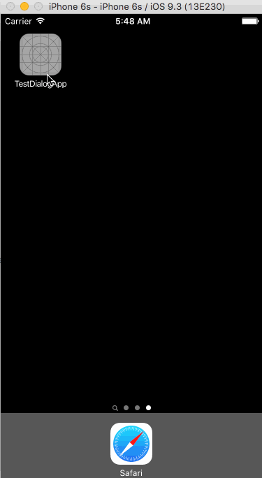

# Xamarin.iOS.DatePickerDialog
Xamarin iOS C# port of https://github.com/squimer/DatePickerDialog-iOS-Swift

## How to use

Install Nuget 
`Install-Package Xamarin.iOS.DatePickerDialog`

```
var startingTime = DateTime.Now;
var dialog = new DatePickerDialog();
dialog.Show("Choose time", "Done", "Cancel", UIDatePickerMode.Time, (dt) =>
{
  TimePickLabel.Text = dt.ToString();
}, startingTime);
```

There are 3 modes supported: 

`UIDatePickerMode.Time`
`UIDatePickerMode.Date`
`UIDatePickerMode.DateAndTime`


